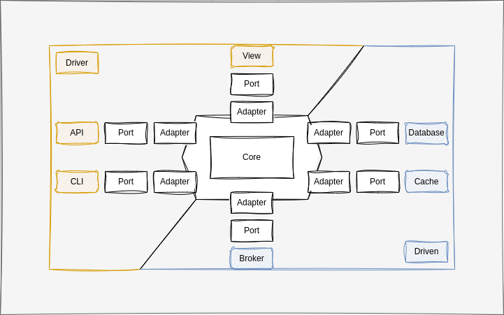

# Ports and Adapters or Hexagonal Architecture in Python

## Usage

### Requirements

- [Docker](https://docs.docker.com/get-docker/)
- [Docker Compose](https://docs.docker.com/compose/install/)
- [Make](https://www.gnu.org/software/make/)
- [Python](https://www.python.org/downloads/)

### Commands

#### Windows

1. `docker compose -f docker-compose.dev.yml up -d postgres` - Start the database.
2. `docker compose -f docker-compose.dev.yml run --rm migrations` - Run the migrations.
3. `docker compose -f docker-compose.dev.yml up -d api` - Start the api and nginx.
4. Go to `https://localhost:8000/docs` to see the swagger documentation.

#### Linux

1. `make certificates` - Generate certificates for https.
2. `docker compose -f docker-compose.prod.yml up -d postgres` - Start the database.
3. `docker compose -f docker-compose.prod.yml run --rm migrations` - Run the migrations.
4. `docker compose -f docker-compose.prod.yml up -d api nginx` - Start the api and nginx.
5. Go to `https://localhost:8443/docs` to see the swagger documentation.

you can also run it outside docker

1. `python -m venv venv` - Create a virtual environment.
2. `source venv/bin/activate` - Activate the virtual environment.
3. `pip install -r requirements.txt` - Install the dependencies.
4. `make migrations` - Run the migrations.
5. `make run` - Start the api.
6. Go to `http://localhost:8000/docs` to see the swagger documentation.

## Architecture

Ports and Adapters or Hexagonal Architecture is an architectural pattern that allows us to create applications that are independent of frameworks, databases, or any external agency. It is also known as the onion architecture.



### Core

Contains the business logic of the application. It is independent of any framework or database.

#### Domain

##### Entities

Contains the domain entities or models.

#### Application

##### Ports

###### Entry Ports

Interfaces used for communication from the outside to the inside of the application. As an example, it can be a service.

###### Exit Ports

Interfaces used for communication from the inside to the outside of the application. As an example, it can be a repository.

##### Use Cases or Services

Contains the use cases or services of the application.

### Adapters

Contains the implementation of the interfaces defined in the core. It is dependent on the core and uses a framework or database.

#### Drivers (Actors)

Are the ones that receive method calls from the outside of the application. As an example, it can be a web server.

#### Driven (Actors)

Are the ones that receive method calls from the inside of the application. As an example, it can be a database.

##### Repositories

Are the ones with the goal of send and receive data from the database or other storage device.

##### Recipients

Are the ones with the goal of only send data and forget it like a message broker or SMTP server.

### Folder Structure

```sh
.
|____.vscode
|____docs
| |____images
|____migrations
| |____alembic
| | |____versions
|____nginx
| |____certificates
|____src
| |____adapter
| | |____driven
| | | |____infra
| | | | |____config
| | | | |____database
| | | | | |____sqlalchemy
| | | | | | |____models
| | | | | | |____repositories
| | |____driver
| | | |____presentation
| | | | |____api
| | | | | |____api_v1
| | | | | | |____endpoints
| | | | | |____controllers
| |____core
| | |____application
| | | |____ports
| | | |____services
| | |____domain
| | | |____base
| | | |____entities
| | | |____value_objects
|____tests
| |____core
| | |____application
| | | |____services
| | |____domain
| | | |____entities
```

## Resources

**Clean architecture python repositories examples**:

- [bobthemighty/python-ports-adapters](https://github.com/bobthemighty/python-ports-adapters)
- [jorzel/opentable](https://github.com/jorzel/opentable)
- [pcieslinski/courses_platform](https://github.com/pcieslinski/courses_platform)
- [evoludigit/clean_fastapi](https://github.com/evoludigit/clean_fastapi)
- [kurosouza/webshop](https://github.com/kurosouza/webshop)

**Patterns**:

- [Unit of work](https://medium.com/@surajit.das0320/understanding-unit-of-work-manager-bcdfb9190d86)

**Protocols**:

- [How https works](https://howhttps.works/)
- [ssl in development environment](https://medium.com/geekculture/webapp-nginx-and-ssl-in-docker-compose-6d02bdbe8fa0)
- [ssl](https://pentacent.medium.com/nginx-and-lets-encrypt-with-docker-in-less-than-5-minutes-b4b8a60d3a71)
- [ssl localhost letsencrypt](https://letsencrypt.org/docs/certificates-for-localhost/)

**Configurations**:

- [How to configure nginx](https://web.archive.org/web/20230321180419/https://www.patricksoftwareblog.com/how-to-configure-nginx-for-a-flask-web-application/)
- [Nginx](https://www.nginx.com/resources/wiki/start/topics/examples/full/)
- [Docker multi stage build](https://pythonspeed.com/articles/multi-stage-docker-python/)
